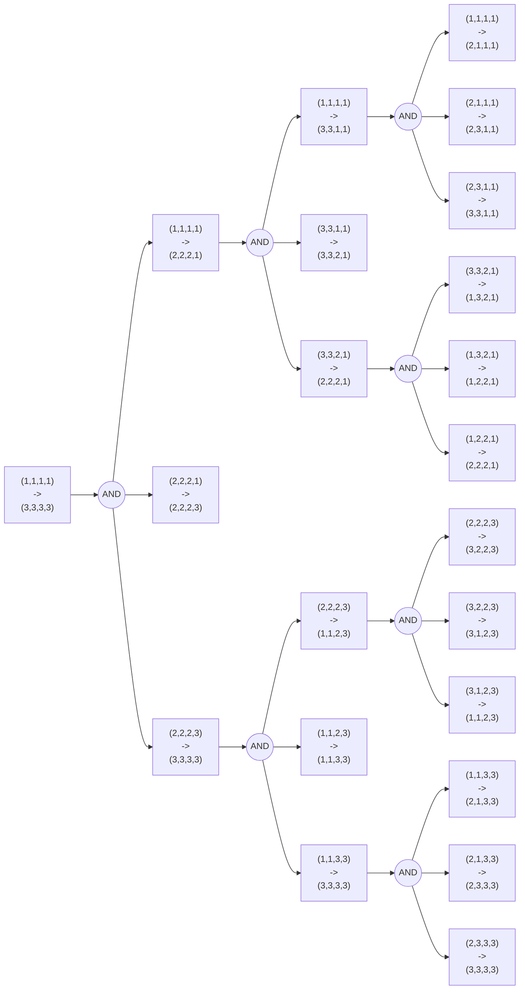
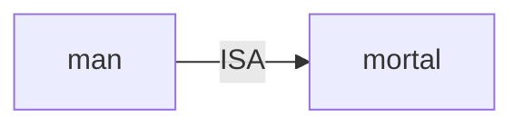
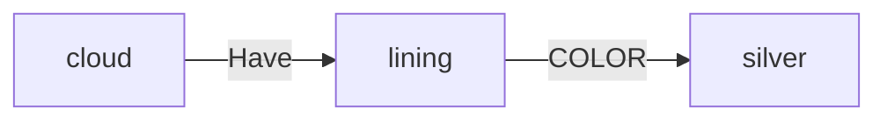
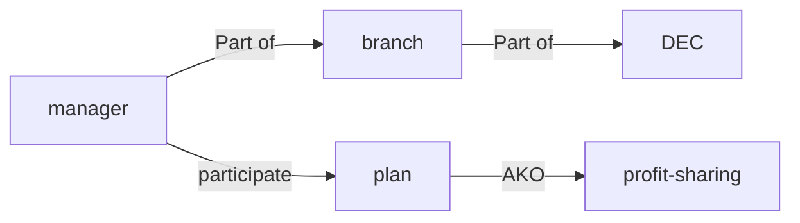

人工智能第七周作业：
第二章习题2-2、2-5、2-6、2-7、2-8
<!--
手写拍照第八周上课前提交至1012997105@qq.com
-->
手写拍照第八周上课前提交至[1012997105@qq.com](mailto:1012997105@qq.com)

---

# 2-2
State: $(\text{leftM}, \text{leftC}, \text{isBoatRight}) \in \{(i,j,k) | i, j \in [0,3]; \ k \in \{0, 1\}; \ (i \ge j) \lor (i = 0); \ ((3 - i) \ge (3 - j), \ i - j \le 0) \lor (i = 3)\}$
Operator: $+(x, y, z), \{(x, y, z) | \forall (i, j, k) \in \text{State}, \ (i + x, j + y, k + z = 1 - k) \in \text{State} \}$

# 2-5

# 2-6
$\forall{\text{computer}}, \ \operatorname{intelli}{(\text{computer})} \leftrightarrow (\exists{\text{task}}, (\operatorname{perform}{(\text{task}, \text{computer})}) \land (\forall \text{human}, \ \operatorname{perform}{(\text{task}, \text{human})} \rightarrow \operatorname{intelli}{(\text{human})}))$

# 2-7
## (1)

## (2)

## (3)

# 2-8
| dorm    |          |
| ------- | -------- |
| ISA     | place    |
| Have    | 4 person |
| Part of | school   |
