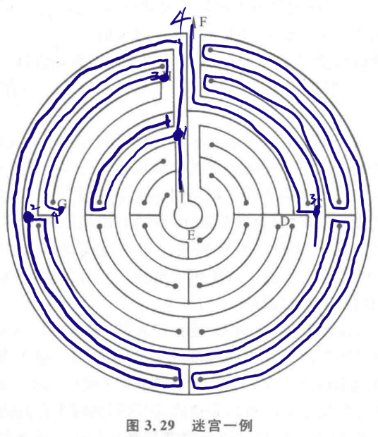

人工智能第八周作业：
<!--
（1）第三章习题3-6、3-7
（2）按宽度优先搜索，写出下图Open和Close表中的变化
（3）总结PPT-Talk5第27页的通用图算法，介绍其流程
（4）按深度优先和宽度优先搜索分别画出求解8数码的图
手写拍照第九周上课前提交至邮箱605432130@qq.com
-->
- （1）第三章习题3-6、3-7
- （2）按宽度优先搜索，写出下图Open和Close表中的变化
- （3）总结PPT-Talk5第27页的通用图算法，介绍其流程
- （4）按深度优先和宽度优先搜索分别画出求解8数码的图
手写拍照第九周上课前提交至邮箱[605432130@qq.com](mailto:605432130@qq.com)

---

# (1)
## 3-6


## 3-7
```cpp
#include <iostream>
#include <vector>
#include <utility>
#include <set>

#define N_MOV 4
#define MAX_STEP 20

using namespace std;

typedef vector<long long> ll_vec;
typedef pair<long long, long long> PLL;
typedef pair<short, long long> stepT;
typedef vector<stepT> proceT;

const PLL Movs[N_MOV] = {{-1, 0}, {1, 0}, {0, -1}, {0, 1}};

inline bool isIdxValid(const vector<ll_vec> &Board, const PLL &idx)
{
    return (idx.first >= 0) && (static_cast<size_t>(idx.first) < (Board.size())) && (idx.second >= 0) && (static_cast<size_t>(idx.second) < ((Board[idx.first].size())));
}

inline vector<proceT> solve(vector<ll_vec> &Board_ini, const vector<ll_vec> &Board_tar, vector<PLL> &PosMovs, const long long maxStep = 0)
{
    vector<proceT> sols;
    auto n = Board_ini.size();
    if ((!(Board_ini.empty())) && (n == (Board_tar.size())) && (!(PosMovs.empty())) && (maxStep >= 0))
    {
        bool flag = true;
        if (Board_ini == Board_tar)
            sols.emplace_back();
        for (vector<ll_vec>::const_iterator it1 = (Board_ini.begin()), it2 = (Board_tar.begin()); it1 < Board_ini.end(); ++it1, ++it2)
            if (it1->size() != (it2->size()))
            {
                flag = false;
                break;
            }
        if (flag)
        {
            proceT procs = {{-1, 0}};
            set<vector<ll_vec>> vis = {Board_ini};
            while (!(procs.empty()))
            {
                auto j = (procs.back()).first + 1;
                for (auto i = (procs.back()).second; flag && (static_cast<size_t>(i) < (PosMovs.size())); ++i, j = 0)
                    for (; flag && (j < N_MOV); ++j)
                        if (isIdxValid(Board_ini, PosMovs[i]) && isIdxValid(Board_ini, {PosMovs[i].first + (Movs[j].first), PosMovs[i].second + (Movs[j].second)}))
                        {
                            swap(Board_ini[PosMovs[i].first][PosMovs[i].second], Board_ini[PosMovs[i].first + (Movs[j].first)][PosMovs[i].second + (Movs[j].second)]), PosMovs[i].first += (Movs[j].first), PosMovs[i].second += (Movs[j].second);
                            if ((vis.find(Board_ini) == vis.end()))
                            {
                                auto temp = procs.back();
                                (procs.back()).first = static_cast<short>(j), (procs.back()).second = i;
                                if (Board_ini == Board_tar)
                                    sols.push_back(procs);
                                else
                                {
                                    if ((!maxStep) || (procs.size() < static_cast<size_t>(maxStep)))
                                        vis.insert(Board_ini), flag = false;
                                }
                                if (flag)
                                    procs.back() = temp;
                            }
                            if (flag)
                                swap(Board_ini[PosMovs[i].first][PosMovs[i].second], Board_ini[PosMovs[i].first - (Movs[j].first)][PosMovs[i].second - (Movs[j].second)]), PosMovs[i].first -= (Movs[j].first), PosMovs[i].second -= (Movs[j].second);
                            else
                            {
                                procs.emplace_back(-1, 0);
                                break;
                            }
                        }
                if (flag)
                {
                    procs.pop_back(), vis.erase(Board_ini);
                    if (!(procs.empty()))
                        swap(Board_ini[PosMovs[(procs.back()).second].first][PosMovs[(procs.back()).second].second], Board_ini[PosMovs[(procs.back()).second].first - (Movs[(procs.back()).first].first)][PosMovs[(procs.back()).second].second - (Movs[(procs.back()).first].second)]), PosMovs[(procs.back()).second].first -= (Movs[(procs.back()).first].first), PosMovs[(procs.back()).second].second -= (Movs[(procs.back()).first].second);
                }
                else
                    flag = true;
            }
        }
    }
    return sols;
}

int main()
{
    long long m = 0, n = 0;
    cin >> m >> n;
    vector<PLL> PosMovs;
    vector<ll_vec> Board_ini(m, ll_vec(n)), Board_tar(m, ll_vec(n));
    for (auto it1 = (Board_ini.begin()); it1 < (Board_ini.end()); ++it1)
        for (auto it2 = (it1->begin()); it2 < (it1->end()); ++it2)
            if ((cin >> (*it2)) && (!(*it2)))
                PosMovs.emplace_back(it1 - Board_ini.begin(), it2 - (it1->begin()));
    for (auto it1 = (Board_tar.begin()); it1 < (Board_tar.end()); ++it1)
        for (auto it2 = (it1->begin()); it2 < (it1->end()); ++it2)
            cin >> (*it2);
    auto Sols = solve(Board_ini, Board_tar, PosMovs, MAX_STEP);
    cout << "Solution count: " << Sols.size() << endl
         << endl;
    for (auto it1 = (Sols.begin()); it1 < Sols.end(); ++it1)
    {
        cout << "Solution " << it1 - (Sols.begin()) << endl;
        vector<PLL> Pos = PosMovs;
        vector<ll_vec> Board = Board_ini;
        for (auto it2 = (it1->begin()); it2 < (it1->end()); ++it2)
        {
            cout << "Step: " << it2 - (it1->begin()) << endl;
            swap(Board[Pos[it2->second].first][Pos[it2->second].second], Board[Pos[it2->second].first + (Movs[it2->first].first)][Pos[it2->second].second + (Movs[it2->first].second)]), Pos[it2->second].first += (Movs[it2->first].first), Pos[it2->second].second += (Movs[it2->first].second);
            for (auto it3 = (Board.begin()); it3 < (Board.end()); ++it3)
            {
                for (auto it4 = (it3->begin()); it4 < (it3->end()); ++it4)
                    cout << (*it4) << ' ';
                cout << endl;
            }
        }
    }
    return 0;
}

```
