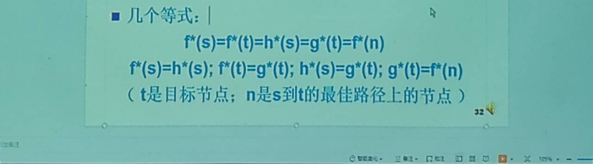

<!--
第九周作业：
1.详细解析下图各等式
2.用两个A*算法解8数码问题，并且结合PPT-Talk6-第39页 定理4判断那种A*算法更好，为什么
3.回答什么是A算法？什么是A*算法
手写拍照第八周上课前提交至1012997105@qq.com
![[def33822ea94fbee57e44e84909fb921.jpeg]]
-->
# 第九周作业
1. 详细解析下图各等式
2. 用两个A\*算法解8数码问题，并且结合PPT-Talk6-第39页 定理4判断那种A\*算法更好，为什么
	   定理 **4** 设有两个**A\*** 算法 **A1\*** 和 **A2\* **，它们有 **A1\*: f1(n)=g1(n)+h1(n)** **A2\*: f2(n)=g2(n)+h2(n)** 如果 **A2\***比**A1\*** 有更多的启发性信息，即对所有非目标节点均有 **h2(n)>h1(n)** 则在搜索过程中，被 **A2\*** 扩展的节点也必然被 **A1\*** 扩展，即 **A1\*** 扩展的节点不会比 **A2\*** 扩展的节点少，亦即 **A2\*** 扩展的节点集是 **A1\*** 扩展的节点集的子集。
3. 回答什么是A算法？什么是A\*算法

<!--
手写拍照第八周上课前提交至[1012997105@qq.com](mailto:1012997105@qq.com)
-->
手写拍照第十周上课前提交至[1012997105@qq.com](mailto:1012997105@qq.com)


---

1. 
	$f^*(x) = g^*(x) + h^*(x)$
	- $f^*(s) = h^*(s)$: $\because s \text{ is the starting point} \therefore g^*(s) = 0$
	- $f^*(t) = g^*(t)$: $\because t \text{ is the target} \therefore h^*(t) = 0$
	- $h^*(s) = g^*(t)$: $\because f^* = \text{const along the optimal path} \land (s, t \text{ are on the optimal path}) \therefore f^*(s) = g^*(s) + h^*(s) = f^*(t) = g^*(t) + h^*(t), \because g^*(s) = h^*(t) = 0$
	- $g^*(t) = f^*(n)$: $\because f^* = \text{const along the best path} \land (t, n \text{ are on the best path}) \therefore f^*(t) = g^*(t) + h^*(t) = f^*(n), \because h^*(t) = 0$
2. 
	```cpp
	#include <iostream>
	#include <vector>
	#include <utility>
	#include <queue>
	#include <map>
	#include <algorithm>
	
	#define N_MOV 4
	
	using namespace std;
	
	typedef vector<long long> ll_vec;
	typedef pair<long long, long long> PLL;
	typedef pair<short, long long> stepT;
	
	struct nodeT
	{
	    vector<ll_vec> board_cur;
	    vector<stepT> procs;
	    vector<PLL> posMovs;
	    long long f_val;
	    bool operator<(const nodeT &other) const
	    {
	        return other.f_val < f_val;
	    }
	};
	
	const PLL Movs[N_MOV] = {{-1, 0}, {1, 0}, {0, -1}, {0, 1}};
	
	inline bool isIdxValid(const vector<ll_vec> &Board, const PLL &idx)
	{
	    return (idx.first >= 0) && (static_cast<size_t>(idx.first) < (Board.size())) && (idx.second >= 0) && (static_cast<size_t>(idx.second) < ((Board[idx.first].size())));
	}
	
	inline long long calBoardHVal_1(const vector<ll_vec> &Board_cur, const vector<ll_vec> &Board_tar, const vector<PLL> &PosMovs)
	{
	    long long h_val = -1;
	    if (Board_cur.size() == (Board_tar.size()))
	    {
	        h_val = 0;
	        for (auto it1 = (Board_cur.begin()), it2 = (Board_tar.begin()); it1 < (Board_cur.end()); ++it1, ++it2)
	            if (it1->size() == (it2->size()))
	            {
	                for (auto it3 = (it1->begin()), it4 = (it2->begin()); it3 < (it1->end()); ++it3, ++it4)
	                    if (((*it3) != (*it4)) && (find(PosMovs.begin(), PosMovs.end(), (PLL){it1 - (Board_cur.begin()), it3 - (it1->begin())}) == PosMovs.end()))
	                        ++h_val;
	            }
	            else
	                return -1;
	    }
	    return h_val;
	}
	
	inline long long calBoardHVal_2(const vector<ll_vec> &Board_cur, const vector<ll_vec> &Board_tar, const vector<PLL> &PosMovs)
	{
	    long long h_val = -1;
	    if (Board_cur.size() == (Board_tar.size()))
	    {
	        h_val = 0;
	        for (auto it1 = (Board_cur.begin()), it2 = (Board_tar.begin()); it1 < (Board_cur.end()); ++it1, ++it2)
	            if (it1->size() == (it2->size()))
	            {
	                for (auto it3 = (it1->begin()); it3 < (it1->end()); ++it3)
	                    if (find(PosMovs.begin(), PosMovs.end(), (PLL){it1 - (Board_cur.begin()), it3 - (it1->begin())}) == PosMovs.end())
	                    {
	                        long long temp = -1;
	                        for (auto it4 = (Board_tar.begin()); it4 < (Board_tar.end()); ++it4)
	                            for (auto it5 = (it4->begin()); it5 < (it4->end()); ++it5)
	                                if ((*it3) == (*it5))
	                                {
	                                    long long dst = abs((it4 - (Board_tar.begin())) - (it1 - (Board_cur.begin()))) + abs((it5 - (it4->begin())) - (it3 - (it1->begin())));
	                                    temp = ((temp < 0) || (temp > dst)) ? dst : temp;
	                                }
	                        if (temp < 0)
	                            return -1;
	                        else
	                            h_val += temp;
	                    }
	            }
	            else
	                return -1;
	    }
	    return h_val;
	}
	
	inline vector<stepT> solve1_bfs(const vector<ll_vec> &Board_ini, const vector<ll_vec> &Board_tar, const vector<PLL> &PosMovs)
	{
	    if ((!(Board_ini.empty())) && (Board_ini.size() == (Board_tar.size())) && (!(PosMovs.empty())) && (Board_ini != Board_tar))
	    {
	        for (auto it1 = (Board_ini.begin()), it2 = (Board_tar.begin()); it1 < Board_ini.end(); ++it1, ++it2)
	            if (it1->size() != (it2->size()))
	                return {};
	        priority_queue<nodeT> Que;
	        // nodeT node = {Board_ini, {}, PosMovs, calBoardHVal_1(Board_ini, Board_tar, PosMovs)};
	        nodeT node = {Board_ini, {}, PosMovs, calBoardHVal_2(Board_ini, Board_tar, PosMovs)};
	        map<vector<ll_vec>, long long> vis = {{Board_ini, 0}};
	        do
	        {
	            if (!(Que.empty()))
	                node = Que.top(), Que.pop();
	            short j = 0;
	            for (long long i = 0; static_cast<size_t>(i) < (node.posMovs.size()); ++i, j = 0)
	                for (; j < N_MOV; ++j)
	                    if (isIdxValid(node.board_cur, node.posMovs[i]) && isIdxValid(node.board_cur, {node.posMovs[i].first + (Movs[j].first), node.posMovs[i].second + (Movs[j].second)}))
	                    {
	                        auto temp = node;
	                        swap(temp.board_cur[temp.posMovs[i].first][temp.posMovs[i].second], (temp.board_cur[temp.posMovs[i].first + (Movs[j].first)][temp.posMovs[i].second + (Movs[j].second)])), temp.posMovs[i].first += (Movs[j].first), temp.posMovs[i].second += (Movs[j].second), temp.procs.emplace_back(j, i);
	                        if ((vis.insert({temp.board_cur, temp.procs.size()}).second) || ((vis[temp.board_cur] > static_cast<long long>(temp.procs.size())) ? (vis[temp.board_cur] = static_cast<long long>(temp.procs.size())) : false))
	                        {
	                            if (temp.board_cur == Board_tar)
	                                return temp.procs;
	                            else
	                                // temp.f_val = static_cast<long long>((temp.procs).size()) + calBoardHVal_1(temp.board_cur, Board_tar, temp.posMovs), Que.push(temp);
	                                temp.f_val = static_cast<long long>((temp.procs).size()) + calBoardHVal_2(temp.board_cur, Board_tar, temp.posMovs), Que.push(temp);
	                        }
	                    }
	        } while (!(Que.empty()));
	    }
	    return {};
	}
	
	int main()
	{
	    long long m = 0, n = 0;
	    cin >> m >> n;
	    vector<PLL> PosMovs;
	    vector<ll_vec> Board_ini(m, ll_vec(n)), Board_tar(m, ll_vec(n));
	    for (auto it1 = (Board_ini.begin()); it1 < (Board_ini.end()); ++it1)
	        for (auto it2 = (it1->begin()); it2 < (it1->end()); ++it2)
	            if ((cin >> (*it2)) && (!(*it2)))
	                PosMovs.emplace_back(it1 - Board_ini.begin(), it2 - (it1->begin()));
	    for (auto it1 = (Board_tar.begin()); it1 < (Board_tar.end()); ++it1)
	        for (auto it2 = (it1->begin()); it2 < (it1->end()); ++it2)
	            cin >> (*it2);
	    auto Sol = solve1_bfs(Board_ini, Board_tar, PosMovs);
	    for (auto it1 = (Sol.begin()); it1 < (Sol.end()); ++it1)
	    {
	        cout << "Step: " << it1 - (Sol.begin()) + 1 << endl;
	        swap(Board_ini[PosMovs[it1->second].first][PosMovs[it1->second].second], Board_ini[PosMovs[it1->second].first + (Movs[it1->first].first)][PosMovs[it1->second].second + (Movs[it1->first].second)]), PosMovs[it1->second].first += (Movs[it1->first].first), PosMovs[it1->second].second += (Movs[it1->first].second);
	        for (auto it2 = (Board_ini.begin()); it2 < (Board_ini.end()); ++it2)
	        {
	            for (auto it3 = (it2->begin()); it3 < (it2->end()); ++it3)
	                cout << (*it3) << ' ';
	            cout << endl;
	        }
	    }
	    return 0;
	}
	
	```
	`calBoardHVal_2` is better because it contains more heuristic information than `calBoardHVal_1`. This means that for all non-goal nodes, `calBoardHVal_2` is always greater or equal to `calBoardHVal_1`, so the algorithm eventually expands fewer or equal nodes according to Theorem 4.
3. 
	- A: Extends nodes based on $f(x) = g(x) + h(x)$
	- A\*: A special case of A, but $h$ is admissible ($\forall x, h(x) \le h^*(x)$)
