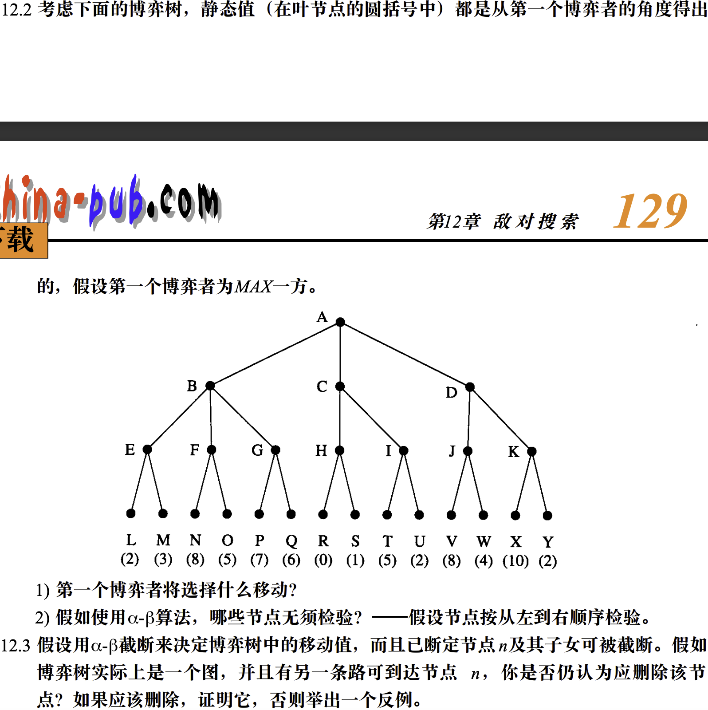

<!--
第十周作业
1.第十二章习题12-2、12-3
2.画出钱币分堆问题的博弈树
3.画出井字棋问题的博弈树
4.写出博弈树的 α - β 剪枝的定义
手写发到605432130@qq.com
-->
# 第十周作业
1. 第十二章习题12-2、12-3
2. 画出钱币分堆问题的博弈树
3. 画出井字棋问题的博弈树
4. 写出博弈树的 α - β 剪枝的定义
手写发到[605432130@qq.com](mailto:605432130@qq.com)

---
