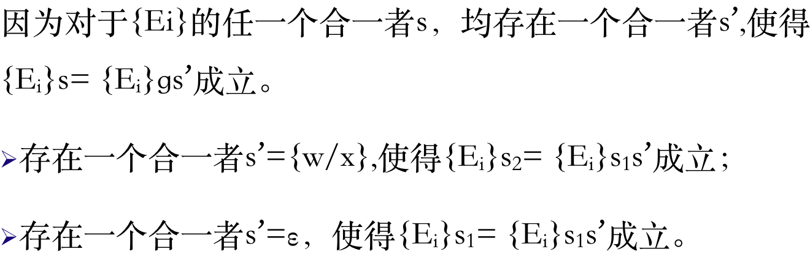

<!--
1.求解上图问题
2.人工智能基础及其应用（第五版）3-15
@全体成员 手写发到1012997105@qq.com
-->

1. 求解上图问题
2. 人工智能基础及其应用（第五版）3-15
   
@全体成员 手写发到[1012997105@qq.com](mailto:1012997105@qq.com)

---

1. 
2. 
	1. $(\forall{x})((\lnot \operatorname{P}{(x)}) \lor (\operatorname{P}{(x)} \land \operatorname{P}{(x)}))$
	2. $(\forall{x} \forall{y})((\lnot \operatorname{On}{(x)}) \lor (\operatorname{On}{(x,y)} \land \operatorname{Above}{(x,y)}))$
	3. $(\forall{x} \forall{y} \forall{z})((\lnot \operatorname{Above}{(x,y)}) \lor (\lnot \operatorname{Above}{(y,z)}) \lor (\operatorname{Above}{(x,y)} \land \operatorname{Above}{(y,z)} \land \operatorname{Above}{(x,z)}))$
	4. $(\exists{x})((\lnot P(x)) \land (\forall{y})(\lnot p(y)) \land (\forall{z})(\lnot Q(x,z)) \lor (\lnot P(x)) \land (\forall{y})(p(f(x,y))) \land (\forall{z})(\lnot Q(x,z)) \lor (\lnot P(x)) \land (\forall{y})(\lnot p(y)) \land (\forall{z})(P(y)) \lor (\lnot P(x)) \land (\forall{y})(p(f(x,y))) \land (\forall{z})(P(y)))$
