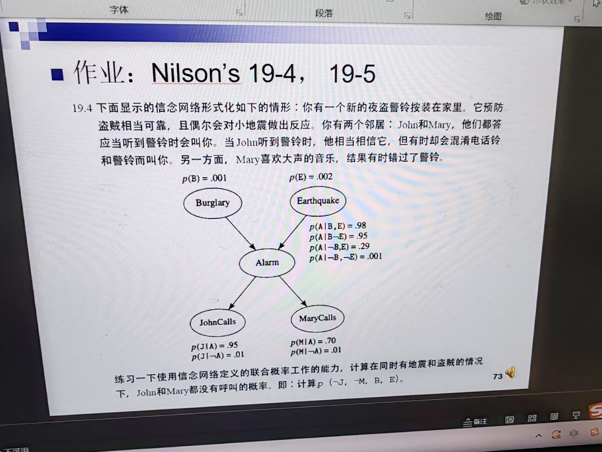

<!--
本周作业，手写拍照发到1012997105@qq.com
-->
本周作业，手写拍照发到[1012997105@qq.com](mailto:1012997105@qq.com)

---

# 19-4
$$\begin{align}
p(\lnot{J},\lnot{M},B,E) & = p(\lnot{J},\lnot{M},A,B,E) + p(\lnot{J},\lnot{M},\lnot{A},B,E) \\
& = (p(\lnot{J},\lnot{M}|A,B,E) p(A|B,E) + p(\lnot{J},\lnot{M}|\lnot{A},B,E) p(\lnot{A}|B,E)) p(B,E) \\
& = (p(\lnot{J},\lnot{M}|A) p(A|B,E) + p(\lnot{J},\lnot{M}|\lnot{A}) p(\lnot{A}|B,E)) p(B) p(E), \ (\text{assume } B \text{ and } E \text{ are independent}) \\
& = (p(\lnot{J}|A) p(\lnot{M}|A) p(A|B,E) + p(\lnot{J}|\lnot{A}) p(\lnot{M}|\lnot{A}) p(\lnot{A}|B,E)) p(B) p(E) \\
& = ((1 - 0.95) \times (1 - 0.70) \times 1 + (1 - 0.01) \times (1 - 0.01) \times 0) \times 0.001 \times 0.002 \\
& \approx 3 \times 10^{-8} \\
\end{align}$$

# 19-5
$$\begin{align}
p(T(B)|R(B)) & = \frac{p(R(B)|T(B))}{p(R(B))} \\
& = \frac{0.8}{90\%}, \ (\text{assume } p(R(B)) = p(T(B))) \\
& = \frac{8}{9} \\
\end{align}$$
